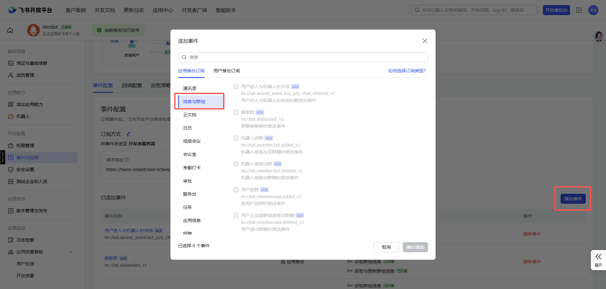

# 飞书Bot AlertBot

功能完整的飞书机器人服务，支持告警管理、消息推送、事件处理、Web管理界面等功能。

## ✨ 功能特性

- 🚨 **告警管理**
  - 接收 Alertmanager 告警并推送到飞书群聊
  - 支持告警规则配置和标签匹配
  - 告警静默功能（2小时/12小时/24小时/3天）
  - 告警数据库存储和查询

- 📨 **消息推送**
  - 支持文本、富文本、卡片等多种消息类型
  - 支持发送给群聊或个人
  - 支持 @用户通知
  - 支持引用回复

- 🤖 **事件处理**
  - 机器人进群自动打招呼
  - 用户进群欢迎消息
  - 接收并处理用户消息
  - 支持命令交互（help、myuid 等）

- 🎛️ **Web管理界面**
  - 可视化告警规则管理
  - 规则增删改查
  - 健康检查

- 💾 **数据库支持**
  - MySQL 配置库（存储告警规则）
  - MySQL 告警库（存储告警记录）
  - 支持数据库分离配置

## 🚀 快速开始

### 1. 环境准备

```bash
# 克隆项目
git clone <repository_url>
cd feishu_bot

# 安装Python依赖
pip install -r requirements.txt
```

### 2. 数据库初始化

```bash
# 导入数据库结构
mysql -u root -p < init.sql
```

### 3. 配置环境变量

创建 `.env` 文件：

```env
# 飞书应用配置
APP_ID=your_app_id
APP_SECRET=your_app_secret
LARK_HOST=https://open.feishu.cn

# MySQL配置数据库
MYSQL_CONFIG_HOST=localhost
MYSQL_CONFIG_PORT=3306
MYSQL_CONFIG_USER=root
MYSQL_CONFIG_PASSWORD=your_password
MYSQL_CONFIG_DATABASE=alert_db

# 服务配置
HOST=0.0.0.0
PORT=3000
DEBUG=False
```

### 4. 启动服务

```bash
python main.py
```

服务将运行在 `http://localhost:3000`

### 5. 测试发送消息

修改 `example_send.py` 中的 `CHAT_ID` 为你的群聊ID：

```bash
python example_send.py
```

## 📡 API接口

### 1. Web 管理界面

```bash
GET http://localhost:3000/
```

访问 Web 管理页面，可视化管理告警规则。

### 2. 健康检查

```bash
GET http://localhost:3000/api/health
```

### 3. 告警接口（接收 Alertmanager 告警）

```bash
POST http://localhost:3000/api/v1/alerts
Content-Type: application/json

{
  "alerts": [
    {
      "status": "firing",
      "labels": {
        "alertname": "HighCPU",
        "severity": "critical"
      },
      "annotations": {
        "summary": "CPU使用率过高"
      }
    }
  ]
}
```

### 4. 发送文本消息

```bash
POST http://localhost:3000/api/send_text
Content-Type: application/json

{
  "chat_id": "oc_xxxxxxxxxxxxxxxx",
  "text": "这是一条测试消息"
}
```

### 5. 发送完整消息

```bash
POST http://localhost:3000/api/send_message
Content-Type: application/json

{
  "receive_id": "oc_xxxxxxxxxxxxxxxx",
  "receive_id_type": "chat_id",
  "msg_type": "text",
  "content": {
    "text": "这是一条测试消息"
  }
}
```

### 6. 告警规则管理

```bash
# 获取所有规则
GET http://localhost:3000/api/alert_rules

# 创建规则
POST http://localhost:3000/api/alert_rules
Content-Type: application/json

{
  "group_id": "oc_xxx",
  "users": ["ou_xxx"],
  "alert_id": "HighCPU",
  "rank": "P0",
  "alertmanager_url": "http://alertmanager:9093",
  "project": "production"
}

# 更新规则
PUT http://localhost:3000/api/alert_rules/1

# 删除规则
DELETE http://localhost:3000/api/alert_rules/1
```

### 7. 飞书事件回调

```bash
POST http://localhost:3000/webhook/event
```

用于接收飞书事件（机器人进群、用户消息等），需在飞书开发者后台配置。

### 8. 卡片交互回调

```bash
POST http://localhost:3000/api/card_callback
```

用于处理卡片交互（如静默按钮点击），需在飞书开发者后台配置。

## 💡 使用示例

### Python调用示例

```python
import requests

# 发送文本消息
url = "http://localhost:3000/api/send_text"
data = {
    "chat_id": "oc_xxxxxxxxxxxxxxxx",
    "text": "告警：服务器CPU使用率超过90%"
}

response = requests.post(url, json=data)
print(response.json())
```

### Alertmanager 集成

在 Alertmanager 配置文件中添加：

```yaml
receivers:
  - name: 'feishu-bot'
    webhook_configs:
      - url: 'http://your-domain:3000/api/v1/alerts'
        send_resolved: true
```

### 机器人命令

在飞书群聊中@机器人：

```
@机器人 help      # 查看帮助
@机器人 myuid     # 查看你的用户ID
```

## 🔧 飞书应用配置

### 1. 创建飞书应用

1. 访问[飞书开发者后台](https://open.feishu.cn/app)
2. 创建企业自建应用
3. 获取 `App ID` 和 `App Secret`

### 2. 配置权限

在"权限管理"中开通以下权限：

- `im:message` - 获取与发送单聊、群组消息
- `im:message.group_at_msg` - 获取群组中所有消息
- `im:message.p2p_msg` - 获取用户发给机器人的单聊消息
- `im:chat` - 获取群组信息

### 3. 配置事件订阅

在"事件订阅"中配置：

**请求地址：** `http://your-domain:3000/webhook/event`

**订阅事件：**
- `im.chat.member.bot.added_v1` - 机器人进群
- `im.chat.member.user.added_v1` - 用户进群
- `im.message.receive_v1` - 接收消息



### 4. 配置卡片回调

在"应用功能-机器人"中配置：

**消息卡片请求网址：** `http://your-domain:3000/api/card_callback`


### 5. 发布版本

配置完成后，创建并发布应用版本。

## 📁 项目结构

```
feishu_bot/
├── main.py                      # 主服务入口
├── config/
│   └── config.py               # 配置管理
├── feishu_utils/               # 飞书工具模块
│   ├── feishu_api.py          # 飞书API客户端
│   ├── event_handler.py       # 事件处理器
│   ├── alert_handler.py       # 告警处理器
│   ├── callback_handler.py    # 回调处理器
│   └── bot_msg_format.py      # 消息格式化
├── alerts_format/              # 告警格式化模块
│   ├── alert_json_format.py   # 告警JSON处理
│   ├── db_utils.py            # 数据库工具
│   ├── ma.py                  # Alertmanager适配
│   └── savedb.py              # 数据库保存
├── static/
│   └── index.html             # Web管理界面
├── init.sql                   # 数据库初始化脚本
├── example_send.py            # 使用示例
├── requirements.txt           # Python依赖
├── .env                       # 环境变量（需自行创建）
├── .gitignore                # Git忽略文件
└── README.md                 # 项目文档
```

## 🎯 如何获取 chat_id

**方法一：飞书网页版**
1. 打开飞书网页版
2. 进入目标群聊
3. 查看URL中的ID: `https://xxx.feishu.cn/messenger/chat/oc_xxxx`

**方法二：通过机器人**
1. 在群聊中@机器人发送消息
2. 查看服务日志，会显示 `chat_id`

**方法三：通过 API**
1. 让机器人进入群聊
2. 查看日志中的进群事件，包含 `chat_id`

## ⚙️ 高级配置

### 数据库分离

如果告警数据量大，可以将告警数据库和配置数据库分离：

```env
# 配置数据库
MYSQL_CONFIG_HOST=config-db.example.com
MYSQL_CONFIG_DATABASE=alert_config

# 告警数据库
MYSQL_ALERT_HOST=alert-db.example.com
MYSQL_ALERT_DATABASE=alert_data
```

### 日志级别

```env
LOG_LEVEL=DEBUG  # DEBUG, INFO, WARNING, ERROR
```

## ⚠️ 注意事项

1. **权限配置**：确保机器人已加入目标群聊，并配置了必要的权限
2. **网络访问**：飞书服务器需要能访问你的回调地址（公网或内网穿透）
3. **HTTPS**：生产环境建议使用 HTTPS
4. **数据库**：确保 MySQL 数据库已启动并可访问
5. **环境变量**：不要将 `.env` 文件提交到版本控制系统

## 📚 更多文档

- [告警静默功能说明](./SILENCE_FEATURE.md) - 详细的静默功能实现文档
- [飞书开发者文档](https://open.feishu.cn/document/) - 官方API文档

## 🤝 贡献

欢迎提交 Issue 和 Pull Request！

## 📄 License

MIT

## 🔗 相关链接

- [飞书开放平台](https://open.feishu.cn/)
- [Alertmanager 文档](https://prometheus.io/docs/alerting/latest/alertmanager/)
- [Flask 文档](https://flask.palletsprojects.com/)
