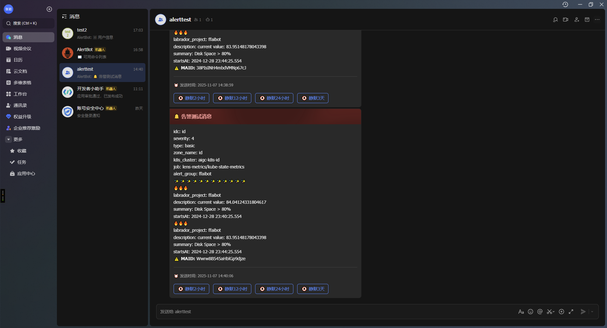
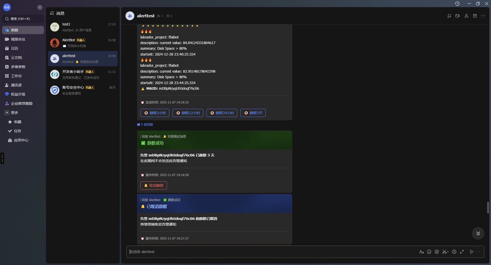
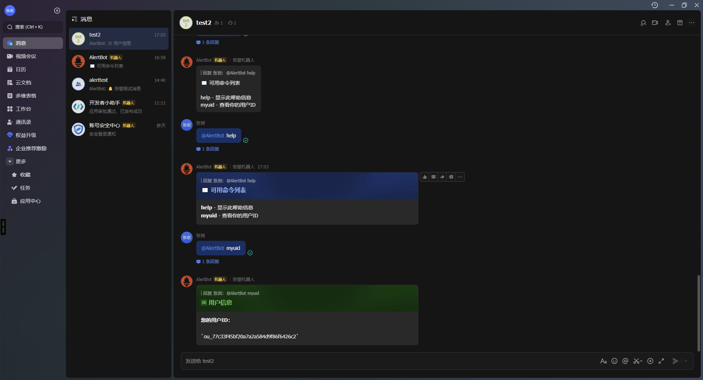
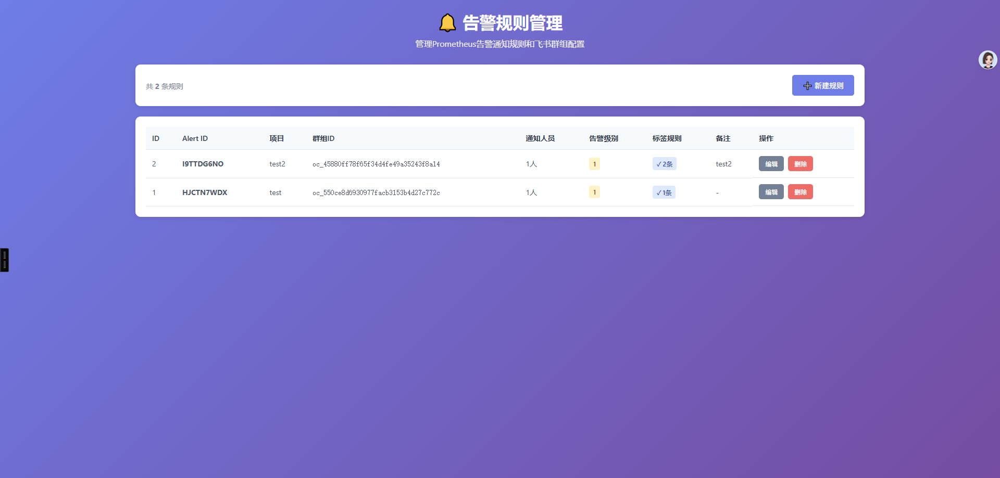
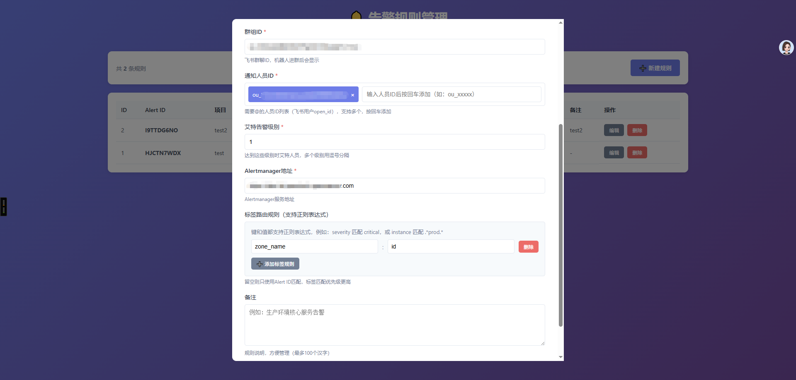
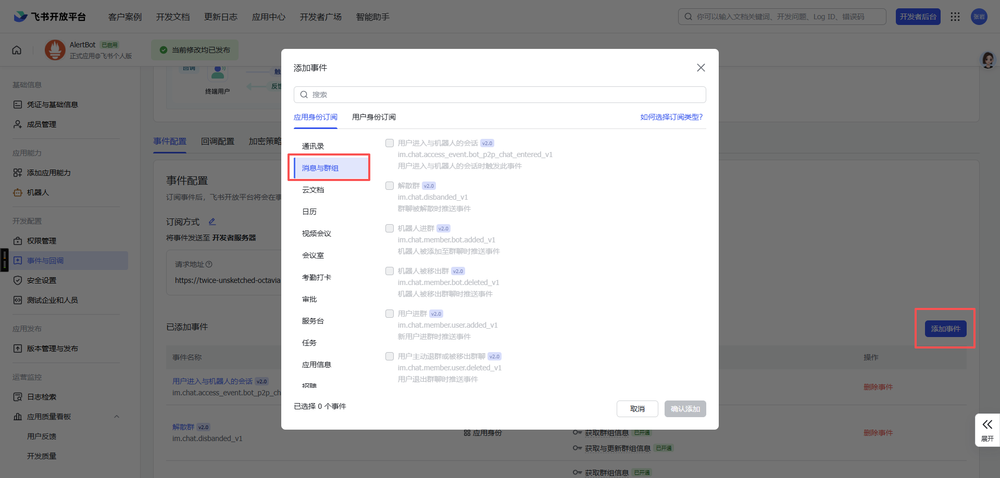
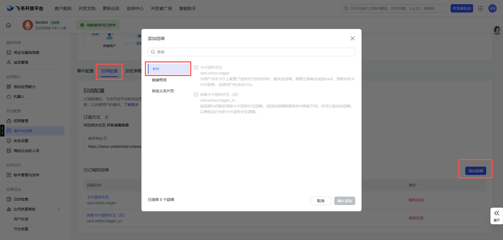

# 飞书Bot AlertBot

功能完整的飞书机器人服务，支持告警管理、消息推送、事件处理、Web管理界面等功能。

## ✨ 功能特性

- 🚨 **告警管理**
  - 接收 Alertmanager 告警并推送到飞书群聊
  - 支持告警规则配置和标签匹配
  - 告警静默功能（快捷时长 + 自定义静默截止日期时间）
  - 告警数据库存储和查询

- 📨 **消息推送**
  - 支持文本、富文本、卡片等多种消息类型
  - 支持发送给群聊或个人
  - 支持 @用户通知
  - 支持引用回复

- 🤖 **事件处理**
  - 机器人进群自动打招呼
  - 用户进群欢迎消息
  - 接收并处理用户消息
  - 支持命令交互（help、myuid、groupid 等）

- 🎛️ **Web管理界面**
  - 可视化告警规则管理
  - 规则增删改查
  - 健康检查

- 💾 **数据库支持**
  - MySQL 配置库（存储告警规则）
  - MySQL 告警库（存储告警记录）
  - 支持数据库分离配置

### 告警发送功能消息效果







## 🚀 快速开始

### 1. 环境准备

```bash
# 克隆项目
git clone <repository_url>
cd feishu_bot

# 安装Python依赖
pip install -r requirements.txt
```

### 2. 数据库初始化

```bash
# 导入数据库结构
mysql -u root -p < init.sql
```

### 3. 配置环境变量

创建 `.env` 文件：

```env
# 飞书应用配置
APP_ID=your_app_id
APP_SECRET=your_app_secret
LARK_HOST=https://open.feishu.cn

# MySQL配置数据库
MYSQL_CONFIG_HOST=localhost
MYSQL_CONFIG_PORT=3306
MYSQL_CONFIG_USER=root
MYSQL_CONFIG_PASSWORD=your_password
MYSQL_CONFIG_DATABASE=alert_db

# 服务配置
HOST=0.0.0.0
PORT=3000
DEBUG=False
```

### 4. 启动服务

```bash
python main.py
```

服务将运行在 `http://localhost:3000`

### 5. 测试发送消息

修改 `example_send.py` 中的 `CHAT_ID` 为你的群聊ID：

```bash
python example_send.py
```

## 📡 API接口

### 1. Web 管理界面

```bash
GET http://localhost:3000/
```

访问 Web 管理页面，可视化管理告警规则。

### 2. 健康检查

```bash
GET http://localhost:3000/api/health
```

### 3. 告警接口（接收 Alertmanager 告警）

```bash
POST http://localhost:3000/api/v1/alerts
Content-Type: application/json

{
  "alerts": [
    {
      "status": "firing",
      "labels": {
        "alertname": "HighCPU",
        "severity": "critical"
      },
      "annotations": {
        "summary": "CPU使用率过高"
      }
    }
  ]
}
```

### 4. 发送文本消息

```bash
POST http://localhost:3000/api/send_text
Content-Type: application/json

{
  "chat_id": "oc_xxxxxxxxxxxxxxxx",
  "text": "这是一条测试消息"
}
```

### 5. 发送完整消息

```bash
POST http://localhost:3000/api/send_message
Content-Type: application/json

{
  "receive_id": "oc_xxxxxxxxxxxxxxxx",
  "receive_id_type": "chat_id",
  "msg_type": "text",
  "content": {
    "text": "这是一条测试消息"
  }
}
```

### 6. 告警规则管理

```bash
# 获取所有规则
GET http://localhost:3000/api/alert_rules

# 创建规则
POST http://localhost:3000/api/alert_rules
Content-Type: application/json

{
  "group_id": "oc_xxx",
  "users": ["ou_xxx"],
  "alert_id": "HighCPU",
  "rank": "P0",
  "alertmanager_url": "http://alertmanager:9093",
  "project": "production"
}

# 更新规则
PUT http://localhost:3000/api/alert_rules/1

# 删除规则
DELETE http://localhost:3000/api/alert_rules/1
```

### 7. 飞书事件回调

```bash
POST http://localhost:3000/webhook/event
```

用于接收飞书事件（机器人进群、用户消息等），需在飞书开发者后台配置。

### 8. 卡片交互回调

```bash
POST http://localhost:3000/api/card_callback
```

用于处理卡片交互（如静默按钮点击），需在飞书开发者后台配置。

## 💡 使用示例

### 趋势告警：按标签或全局启用

部署保持单副本，先依次执行 `migrations/20261005_alert_trend_state.sql` 和
`migrations/20261006_alert_trend_policy.sql`（已执行过的迁移不要重复执行）。
配置 Grafana 只读 key 和 `VM_QUERY_URL` 后，推荐通过以下一种方式启用，无需维护规则 UID。

**按现有标签筛选**：在路由服务的环境变量中设置，重启服务生效。例如只接入糖番茄的延迟告警：

```dotenv
TREND_GATE_MODE=labels
TREND_LABEL_MATCHERS={"tenant":"tenant-b4n1c8awyyfn5","alertname":".*(TPOT|TTFT).*"}
```

标签取单条 webhook 告警的 `labels`，标签名精确匹配，值为正则且匹配完整字符串，
所有条件需同时满足。不要把 Grafana 的 rule group 名直接当作标签，除非 webhook 确实携带。
也可以给需要启用的 Grafana 规则添加 `trend_gate=true` 标签，使用默认筛选：

```dotenv
TREND_GATE_MODE=labels
TREND_LABEL_MATCHERS={"trend_gate":"true"}
```

**全局自动识别**：只需设置：

```dotenv
TREND_GATE_MODE=all
```

两种模式下，路由 `trend_policy=NULL` 均继承全局配置，新建的匹配规则也自动生效。
阈值、恢复阈值和比较方向继续从 Grafana 读取；请求量计数器根据 PromQL 自动识别：

| 指标表达式 | 请求量计数器 | 支持方向 |
| --- | --- | --- |
| `magik_model_tpot_ms_bucket` | `magik_model_tpot_ms_count` | 越高越严重 |
| `magik_model_ttft_ms_bucket` | `magik_model_ttft_ms_count` | 越高越严重 |
| 用 `magik_model_response_total` 计算成功比例 | `magik_model_response_total` | 越低越严重 |

自动识别仅支持 threshold 直接引用 PromQL 查询且比较符为 gt/lt 的规则；含中间表达式、
未知指标、混合多种指标或无法查询规则时，沿用普通通知，不建立趋势去重状态。
指标仍统一查询 `VM_QUERY_URL`，应指向这些规则实际使用的数据源/租户；不自动跨数据源查询。
这些模式默认使用 `request_metric=auto`，不使用旧 `TREND_REQUEST_METRIC` 的 TPOT 默认值。
指标样本不足或请求量计数器缺失时仍直接通知，不会假定问题已恢复。

`severity=phone` 或 `trend_gate=false`（也接受 off/0）的告警跳过新策略，直接走原通知流程。
全局启用不改变原有群路由、Grafana pending 时间，也不提供跨恢复轮次冷却。
成功率硬下限默认不启用；如要设置，应确认查询单位一致，或只在相应路由覆盖。

**单条路由可选覆盖**：通过 PUT `/api/alert_rules/<id>` 设置以下任一策略：

```json
{"trend_policy":{"match_labels":{"alertname":".*TPOT.*"},"observe_seconds":60}}
```

```json
{"trend_policy":{"match_all":true,"observe_seconds":120}}
```

```json
{"trend_policy":{"enabled":false}}
```

显式路由策略优先于全局配置；关闭、非法或未匹配时，该路由按原流程发送。
传 `null` 恢复继承。多个选择条件（UID、标签）同时填写时按 AND 匹配；`match_all` 不取消其他条件。
标签筛选为空对象、正则非法或模式拼写错误时不扩大到全局。默认 `TREND_GATE_MODE=legacy`
保持原有按路由 UID/旧环境变量的行为。

同一告警命中多条路由时，关闭或未匹配趋势策略的路由仍使用普通的同群同名冷却
（默认 5 分钟）；发送失败允许重试，收到恢复通知清除冷却。趋势观察、紧急升级不受
这层普通冷却影响。旧试点开关仍为 true、但启用范围已改由新模式/路由策略决定时，
进程只警告一次，提示核对旧试点是否仍被选择，不自动扩大标签筛选范围。

标签/全局模式验收：先在测试群验证一条匹配与一条不匹配的告警；匹配者进入观察，
不匹配者按原流程发送。再确认 phone/false 标签绕过、TTFT/成功率计数器选取正确、
同一观察卡片原地更新及路由关闭覆盖有效。运行回归测试不访问真实外部服务。

### 可选：兼容按规则 UID 配置

部署保持单副本。先依次执行 `migrations/20261005_alert_trend_state.sql` 和
`migrations/20261006_alert_trend_policy.sql`，再通过 POST `/api/alert_rules` 或
PUT `/api/alert_rules/<id>` 设置 `trend_policy`（JSON 对象或对象的 JSON 字符串，
传 null 清空）。配置变更会失效策略与路由缓存，缓存 TTL 为 `ALERT_CONFIG_CACHE_TTL`。

```json
{
  "trend_policy": {
    "enabled": true,
    "rule_uids": ["成功率规则的UID"],
    "observe_seconds": 120,
    "hard_floor": 0.95,
    "request_metric": "业务实际使用的请求counter指标名",
    "slow_window_seconds": 600,
    "min_requests": 20,
    "confirm_cycles": 2
  }
}
```

UID 模式填写非空的 `rule_uids`；也可改用上述 `match_labels` 或 `match_all`。
`enabled` 缺省为 true，其他参数默认值见 `.env.example`。
`request_metric` 必须是合法指标名，示例中的中文占位内容需替换。成功率的阈值与
`hard_floor` 使用原查询单位：0–1 比例可配置 0.95，0–100 百分数应配置 95。
硬下限缺省不启用。查询指标时按 tenant/model/ep 匹配唯一序列，无法唯一匹配则直接发送。

Grafana `gt` 条件表示越高越严重，TPOT、TTFT 默认统一观察 180 秒，
达到阈值 2.5 倍或最近 90 秒中位数比前 90 秒上涨至少 20%（且增量至少为阈值的 5%）时立即发送。`lt` 表示越低越严重：
先检查硬下限，再确认恢复；快窗口（60 秒）和慢窗口（默认 600 秒）的中位数均
低于或等于触发阈值时立即发送；仅快窗口越线则观察，到期仍越线也发送。
指标样本不足、规则或指标查询失败时直接发送，沿用原有 @ 配置。

TPOT、TTFT 发送前额外确认最近 90 秒的原始 histogram 观测。只有样本新鲜、
观测量达到 `min_requests`，且全部观测均落在恢复阈值以内的桶时，才保留群通知
并取消艾特；同一轮恶化 25% 的升级也遵守这个结果。阈值桶缺失时使用更低的桶
保守判断，单位依据规则原表达式转换。短窗口查询失败、数据不足或表达式无法
识别时保留原有艾特判断；phone 告警仍按原紧急流程处理。这只确认已记录的延迟，
不代表未完成请求或错误率恢复。日志 `event=trend.short_window` 记录观测数、
慢观测数、桶边界与恢复结果，卡片描述附上取消艾特的原因。

观察时长由 `TREND_OBSERVE_SECONDS=180` 统一配置（部署时放入 `feishu-bot-secret`）；
已有路由若显式填写了 `observe_seconds`，仍优先使用路由值，应移除覆盖才能统一。
180 秒从路由首次进入观察开始计算，不含 Grafana 自身 pending 和指标查询窗口。
每 15 秒复查一次，到期在下一次复查中处理，存在调度和查询耗时；不增加动态延长。

`TREND_IMPACT_ENABLED=true` 为 TTFT/TPOT 启用影响分级，替代上述“零新增慢观测”降级条件。
部署将开关及 `TREND_IMPACT_SHORT_SECONDS=90`、`TREND_IMPACT_LONG_SECONDS=300` 放入
`feishu-bot-secret`；关闭开关即恢复旧判定。仍由现有标签/路由策略决定参与范围。

对于规则分位数 q，慢观测比例边界为 `1-q`（P99=1%、P95=5%、P50=50%），
这表示现有分位数规则的边界，并非另行定义业务 SLO。直接读取原表达式相同维度的
累计 histogram 桶，按表达式转换单位；阈值不在桶边界时计算比例上下界，不插值猜测。
使用 `max(min_requests, ceil(1/(1-q)))` 作为窗口样本下限，P99 默认至少 100 个观测。

| 证据 | 处理 |
| --- | --- |
| 短窗口中，超过 2.5 倍触发阈值的慢观测比例下界超过 `1-q` | 立即 P0，按路由艾特值班人/指定用户 |
| 短、长窗口超过触发阈值的慢观测比例下界均超过 `1-q` | 立即 P0，即使数值保持平台也升级 |
| 短窗口超过恢复阈值的比例上界不超过 `1-q`，且近期响应有足够成功样本、无 5xx/408 | 普通发送为 P1、不艾特；尚在轻微观察期则继续观察，已确认恢复则取消 |
| 边界不确定，观察到期或原判断为明显恶化/硬上限 | 保留 P0；观察时间不延长 |
| 规则/指标查询失败、缺桶、样本不足、样本过旧、counter 重置或响应证据不完整 | 按原告警等级与艾特配置立即发送，绝不据此降级 |

同一事件已发送 P1 后，确认 P0 可越过数值上涨 25% 和普通冷却条件补发紧急通知；
P1 后查询失去证据则按原级别补发一次。成功通知的等级保存于
`alert_trend_state.payload._trend_last_notification_severity`，失败不会写入成功等级，重启后仍能升级。
旧状态没有等级证据时，首次确认 P0 保守补发一次。原始 severity 标签、fingerprint 和静默 matcher 保持原值；
卡片展示等级单独覆盖。`event=trend.impact` 记录各窗口占比上下界、样本数、阈值、响应错误与结果，
`event=trend.decision`、`event=alert.grade` 可通过原 MAID 串联最终等级。

TPOT histogram 的观测可能按 token 记录，比例不能直接当作受影响请求比例。
这些证据只覆盖已记录的观测；完全卡住的在途请求仍须依赖独立的超时、成功率或在途量告警。

VM 实时单点区间查询（`start=end`）显式设置 `latency_offset=1ms`，避免默认查询延迟
把当前单点裁为空、误触发兜底；普通历史区间/原 instant 查询保留既有行为。
这不替代源样本新鲜度、counter 重置、桶完整性和最小样本量检查。

### MAID 日志关联

路由匹配时即生成 MAID，观察 payload 持久化保存，后台复查、通知入库、发送、
恢复及卡片操作沿用对应 MAID。正常 Grafana 输入按群组、fingerprint、startsAt
识别同一轮；不同群组或新一轮触发分别生成 ID。缺少 startsAt 的输入使用随机 ID，
趋势观察继续通过持久化 payload 关联。旧版本已发送告警的恢复和回调沿用原数据库 MAID。

应用日志统一包含 `maid`、`request_id`、`group_id`、`fingerprint`。
批次公共日志和观察汇总发送日志可含多个 MAID；查找时按 ID 本身做字符串匹配：

```bash
kubectl -n grafana logs deployment/feishu-bot-v1 --since=24h | rg -F '实际MAID'
```

`event=trend.select/route.select` 记录是否启用；`trend.evaluate` 记录指标、阈值、
窗口中位数、样本量、观察计时和原因；`trend.notify.skip` 记录已通知后的抑制；
`trend.state.*`、`trend.recheck.schedule` 记录状态与下次复查；`alert.mention`
记录最终 @ 人数，`alert.callback` 记录卡片操作。数据库决策表结构无需迁移。
`alert.detail` 在 INFO 级别记录标签、注释、值、fingerprint 和起止时间；
`route.lookup/detail/unmatched` 记录匹配输入、命中路由及未匹配结果。
DEBUG 级别另有 `alert.payload` 接收内容，凭据字段和常见令牌会脱敏。
未进入趋势判断也会记录原因；无变化的观察汇总不重复刷日志。
启动、路由尚未确定时的基础设施错误、健康检查等无具体告警上下文的日志显示 `maid=-`；
旧日志不会补写字段。完整历史需在日志平台按 MAID 检索，容器日志受保留时间限制。

### 通知与恢复行为

状态按规则 UID、群组、fingerprint 隔离。已通知的同一轮普通重复告警被抑制；
数值比上次通知恶化 25% 才升级（越高越严重为 >=1.25 倍，越低越严重为 <=0.75 倍）。
硬阈值、明显恶化和升级通知可 @ 当前值班人；观察到期的普通越线消息不 @。
恢复后再次越线属于新一轮，当前版本仍不提供跨轮次冷却。

新策略的 pending 复查需要连续 `confirm_cycles` 次 cancel 才结束观察（默认 2 次，
约间隔 15 秒）。中途 observe/send 或升级缓解会清零计数，重启后计数从数据库恢复。
HTTP 首次判断 cancel 仍立即结束；sent 状态仍等待 Grafana resolved webhook 收敛。
旧环境变量试点不启用此防抖，保持原有立即取消行为。

存在新策略时，每轮复查会将全部 pending 实例（包括未到复查时间的实例）按群
合并为一张“👀 趋势告警观察中”卡片，不 @ 任何人。卡片显示关键维度、最近决策值、
阈值、观察时长和原因；后续 PATCH 原卡片。正文 hash 相同则跳过更新，时长按分钟
显示，“更新于”记录实际更新时间且不参与 hash。全部结束后原卡片改为
“当前无观察中的趋势告警”，以后继续复用该消息 ID。卡片发送失败只记录日志。

`TREND_GATE_MODE=legacy` 且未执行迁移或没有任何启用策略时，回退 `TREND_GATE_ENABLED` / `TREND_RULE_UID`
旧试点（默认关闭，默认 UID `tfk3tpot5p0e3f`），回退只警告一次。
只要存在启用策略，便按每条路由的 UID/标签选择条件启用，无需打开旧试点环境开关；
无策略、无匹配 UID 或策略非法的路由直接发送。复用原有单个后台复查线程，
运行时经 CRUD 新增策略也会自动生效。

查询配置需要 `VM_QUERY_URL`（以 `/api/v1/query` 或 `/api/v1/query_range` 结尾），
Grafana 使用 `GRAFANA_RULES_READ_KEY` 或现有 `GRAFANA_API_KEY`。
内网 VM 无认证时省略 `VM_USER` / `VM_PASSWORD`；凭据仅存放在运行环境或 Secret。

启用新策略后，复查线程每小时清理超过 `TREND_LOG_RETENTION_DAYS`（默认 90 天）的
决策日志；清理失败只记日志，下一周期重试。`scripts/trend_review.sql` 提供抑制错误率、
骚扰信号、电话认领比例三项只读查询，使用 MySQL 5.7 兼容写法。
这些是近似指标：cancel 包含未确认恢复，send 不代表实际已发送，数据库没有静默
操作时间，电话认领只通过持久化卡片回执判断。各项偏差写在 SQL 注释中。

#### 手工验收清单（在测试群和隔离环境执行）

1. 使用已有表的测试库依次执行两份迁移（ALTER 只执行一次）；全新库直接用 `init.sql`。
   确认 `alert_config.trend_policy`、`alert_trend_state.cancel_streak` 和
   `alert_trend_digest` 已存在，部署为单副本。
2. 配置查询地址与只读 Grafana Key。通过 PUT `/api/alert_rules/<路由ID>` 写入上面的
   `trend_policy`，将 UID 与 counter 名替换为实际成功率规则/指标；用 GET 验证保存结果。
   用非法 JSON、数组分别请求 POST/PUT 应返回 400，NULL 则清空策略。
3. 向 POST `/api/v1/alerts` 提交匹配该路由的 Grafana webhook：`status=firing`，
   单条 alert 带真实的 tenant/model/ep、稳定 fingerprint，`generatorURL` 为
   `https://<grafana>/alerting/grafana/<UID>/view`。用另一条未配置策略的匹配路由
   验证其直接发送。以下时间序列需由测试指标源提供，不能只改 webhook 上的数值。
4. 成功率阈值 0.99、恢复值 0.995、硬下限 0.95；请求量 >=20，慢窗口为 1.0、
   最近 60 秒为 0.98 时应观察。一次提交同群两个实例，确认只有一张无 @ 的观察卡片，
   包含两个实例，`alert_trend_digest.message_id` 后续不变；正文不变时无 PATCH。
5. 最近值回升至 0.996，第一次 worker cancel 后仍 pending，日志原因为
   `恢复待确认(1/2)`，streak=1；第二次连续 cancel 后 resolved 且 streak=0。
   两次 cancel 之间再 observe 应清零；HTTP 首次 cancel 仍立即 resolved。
   全部实例退出 pending 后，原卡片显示“当前无观察中的趋势告警”。
6. 快慢窗口都为 0.98 或最新值 <=0.95 时应发送并按路由 @ 值班人；仅快窗口越线
   持续到观察期限应发送但不 @。验证 sent 实例以 <=上次通知值*0.75 的方向升级，
   其 resolved webhook 正常收敛。验证 TPOT 默认 30/25 阈值及 45 硬上限行为不变。
7. SELECT 检查 `alert_trend_decision_log` 的 action/value/reason 与上述步骤一致；
   测试库准备超过保留期的日志，等待清理周期，确认旧日志清除、新日志保留。
   在 UTC 会话执行 `scripts/trend_review.sql`。Grafana/VM/卡片更新失败应有日志，
   查询失败的待通知实例仍发送，其他实例继续复查。
8. 用隔离旧表结构或 mock 验证未迁移/策略全空时回退旧环境变量试点，只提示一次；
   不出现新汇总卡片或恢复防抖。自动测试命令为
   `python test/trend_gate_regression.py` 和 `python test/regression_test.py`。


### Python调用示例

```python
import requests

# 发送文本消息
url = "http://localhost:3000/api/send_text"
data = {
    "chat_id": "oc_xxxxxxxxxxxxxxxx",
    "text": "告警：服务器CPU使用率超过90%"
}

response = requests.post(url, json=data)
print(response.json())
```

### Alertmanager 集成

在 Alertmanager 配置文件中添加：

```yaml
receivers:
  - name: 'feishu-bot'
    webhook_configs:
      - url: 'http://your-domain:3000/api/v1/alerts'
        send_resolved: true
```

### 机器人命令

在飞书群聊中@机器人：

```
@机器人 help      # 查看帮助
@机器人 myuid     # 查看你的用户ID
@机器人 groupid   # 查看当前群组ID
```

## 🔧 飞书应用配置

### 1. 创建飞书应用

1. 访问[飞书开发者后台](https://open.feishu.cn/app)
2. 创建企业自建应用
3. 获取 `App ID` 和 `App Secret`

### 2. 配置权限

在"权限管理"中开通以下权限：

- `im:message` - 获取与发送单聊、群组消息
- `im:message.group_at_msg` - 获取群组中所有消息
- `im:message.p2p_msg` - 获取用户发给机器人的单聊消息
- `im:chat` - 获取群组信息

### 3. 配置事件订阅

在"事件订阅"中配置：

**请求地址：** `http://your-domain:3000/webhook/event`

**订阅事件：**
- `im.chat.member.bot.added_v1` - 机器人进群
- `im.chat.member.user.added_v1` - 用户进群
- `im.message.receive_v1` - 接收消息



### 4. 配置卡片回调

在"应用功能-机器人"中配置：

**消息卡片请求网址：** `http://your-domain:3000/api/card_callback`



### 5. 发布版本

配置完成后，创建并发布应用版本。

## 📁 项目结构

```
feishu_bot/
├── main.py                      # 主服务入口
├── config/
│   └── config.py               # 配置管理
├── feishu_utils/               # 飞书工具模块
│   ├── feishu_api.py          # 飞书API客户端
│   ├── event_handler.py       # 事件处理器
│   ├── alert_handler.py       # 告警处理器
│   ├── callback_handler.py    # 回调处理器
│   └── bot_msg_format.py      # 消息格式化
│   ├── __init__.py            # 模块初始化
├── alerts_format/              # 告警格式化模块
│   ├── alert_json_format.py   # 告警JSON处理
│   ├── db_utils.py            # 数据库工具
│   ├── ma.py                  # Alertmanager适配
│   └── savedb.py              # 数据库保存
├── static/
│   └── index.html             # Web管理界面
├── init.sql                   # 数据库初始化脚本
├── example_send.py            # 使用示例
├── requirements.txt           # Python依赖
├── .env                       # 环境变量（需自行创建）
├── .gitignore                # Git忽略文件
└── README.md                 # 项目文档
```

## 🎯 如何获取 chat_id

**方法一：通过机器人命令（推荐）**
1. 让机器人进入目标群聊
2. 在群聊中@机器人发送：`@机器人 groupid`
3. 机器人会直接回复当前群组的 chat_id

**方法二：飞书网页版**
1. 打开飞书网页版
2. 进入目标群聊
3. 查看URL中的ID: `https://xxx.feishu.cn/messenger/chat/oc_xxxx`

**方法三：通过日志**
1. 让机器人进入群聊
2. 查看服务日志中的进群事件或消息事件，包含 `chat_id`

## ⚙️ 高级配置

### 数据库分离

如果告警数据量大，可以将告警数据库和配置数据库分离：

```env
# 配置数据库
MYSQL_CONFIG_HOST=config-db.example.com
MYSQL_CONFIG_DATABASE=alert_config

# 告警数据库
MYSQL_ALERT_HOST=alert-db.example.com
MYSQL_ALERT_DATABASE=alert_data
```

### 日志级别

```env
LOG_LEVEL=DEBUG  # DEBUG, INFO, WARNING, ERROR
```

## ⚠️ 注意事项

1. **权限配置**：确保机器人已加入目标群聊，并配置了必要的权限
2. **网络访问**：飞书服务器和 外部依赖服务需要能访问你的回调地址（公网或内网穿透）
3. **HTTPS**：生产环境建议使用 HTTPS
4. **数据库**：确保 MySQL 数据库已启动并可访问
5. **环境变量**：不要将 `.env` 文件提交到版本控制系统
## 📚 更多文档

- [告警静默功能说明](./SILENCE_FEATURE.md) - 详细的静默功能实现文档
- [飞书开发者文档](https://open.feishu.cn/document/) - 官方API文档

## 🤝 贡献

欢迎提交 Issue 和 Pull Request！

## 📄 License

MIT

## 🔗 相关链接

- [飞书开放平台](https://open.feishu.cn/)
- [Alertmanager 文档](https://prometheus.io/docs/alerting/latest/alertmanager/)
- [Flask 文档](https://flask.palletsprojects.com/)
